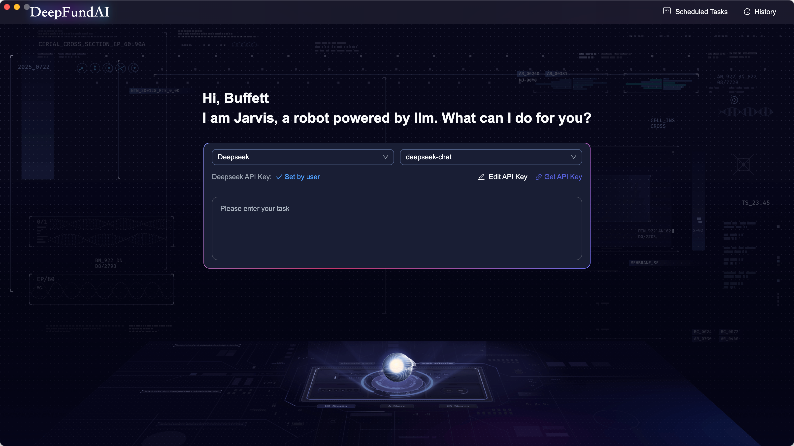
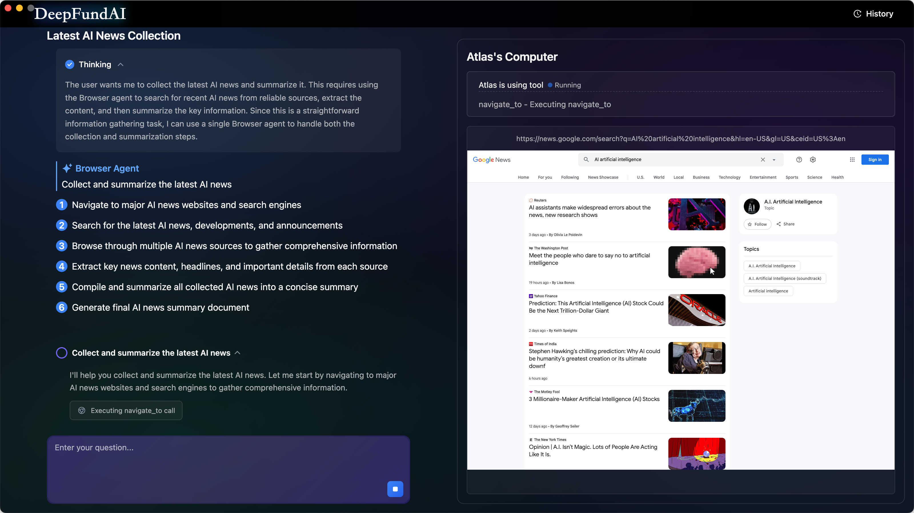
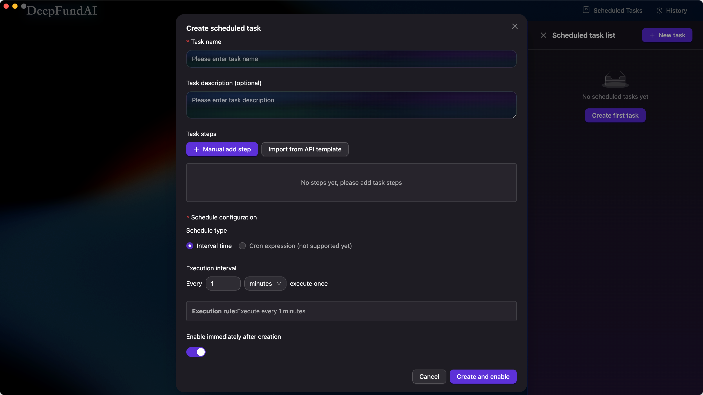
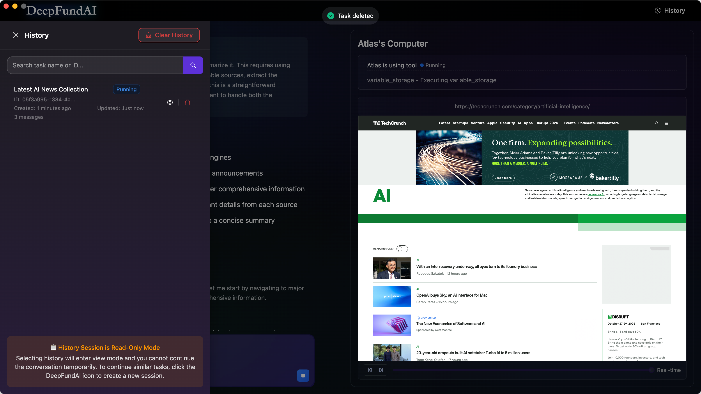

# AI Browser

[English](./README.md) | [简体中文](./README.zh-CN.md)

An AI-powered intelligent browser built with Next.js and Electron. Features multi-modal AI task execution, scheduled tasks, social media integration, and advanced file management capabilities with support for multiple AI providers.

Built with [Next.js](https://nextjs.org) and [Electron](https://electronjs.org).

## Tech Stack

- **Frontend**: Next.js 15 + React 19
- **Desktop**: Electron 33
- **UI**: Ant Design + Tailwind CSS
- **State Management**: Zustand
- **Storage**: IndexedDB (via electron-store)
- **AI Agent**: @jarvis-agent (based on [Eko](https://github.com/FellouAI/eko) - production-ready agent framework)
- **Build Tools**: Vite + TypeScript

## Development Environment Configuration
Node version: 20.19.3

## Getting Started

### 1. Configure API Keys

Before running the application, you need to configure API keys:

```bash
# Copy configuration template
cp .env.template .env.local

# Edit .env.local and fill in your API keys
# Supported: DEEPSEEK_API_KEY, QWEN_API_KEY, GOOGLE_API_KEY, ANTHROPIC_API_KEY, OPENROUTER_API_KEY
```

For detailed configuration instructions, see [CONFIGURATION.md](./docs/CONFIGURATION.md).

### 2. Development Setup

First, run the development server:

```bash
# Install dependencies
pnpm install

# Build desktop application client for mac
pnpm run build:deps

# Build desktop application client for windows
pnpm run build:deps:win

# Start web development server
pnpm run next

# Start desktop application
pnpm run electron
```

### 3. Building Desktop Application

To build the desktop application for distribution:

```bash
# Configure production API keys
# Edit .env.production file with your actual API keys

# Build the application for mac
pnpm run build

# Build the application for windows
pnpm run build:win
```

The built application will include your API configuration, so end users don't need to configure anything.

## Features

- **Multiple AI Providers**: Support for DeepSeek, Qwen, Google Gemini, Anthropic Claude, and OpenRouter
- **UI Configuration**: Configure AI models and API keys directly in the app, no file editing required
- **Agent Configuration**: Customize AI agent behavior with custom prompts and manage MCP tools
- **Toolbox**: Centralized hub for system features including agent configuration, scheduled tasks, and more
- **AI-Powered Browser**: Intelligent browser with automated task execution
- **Multi-Modal AI**: Vision and text processing capabilities
- **Scheduled Tasks**: Create and manage automated recurring tasks
- **Speech & TTS**: Voice recognition and text-to-speech integration
- **File Management**: Advanced file operations and management

## RoadMap

### ✅ Completed Features

**v0.0.1 - v0.0.4: Core Functionality**
- AI-powered browser with automated task execution
- Multiple AI provider support (DeepSeek, Qwen, Google Gemini, Claude, OpenRouter)
- Multi-modal AI capabilities (vision and text processing)
- Scheduled tasks system with custom intervals
- File management capabilities
- UI configuration for API keys and models

**v0.0.5 - v0.0.7: UI/UX Enhancements**
- Purple theme redesign with improved UI/UX
- Agent Configuration system (custom prompts, MCP tools management)
- Toolbox page (centralized feature hub)
- Internationalization support (English/Chinese)
- WebGL animated background with gradient fallback
- Improved modal sizes and layout optimization

**v0.0.8 - v0.0.10: Advanced Features**
- Human interaction support (AI can ask questions during execution)
- Task continuation with file attachment management
- Atomic fragment-based history playback with typewriter effects
- Advanced playback controls (play/pause/restart/speed adjustment)
- Context restoration and session management
- Optimized auto-scroll behavior for messages
- Enhanced message display and rendering

### 🚀 Future Plans

**Phase 1: Enhanced User Experience**
- Voice input support (speech-to-text integration)
- Theme customization system (multiple color schemes)
- Dark/Light mode toggle
- Enhanced accessibility features

**Phase 2: Workflow Enhancement**
- Workflow configuration export/import functionality
- Refactored scheduled task steps based on workflow configuration
- Visual workflow editor with drag-and-drop interface
- Step management (reorder, add, remove, edit workflow steps)
- Workflow templates and presets

**Phase 3: Plugin Ecosystem**
- MCP plugin marketplace
- Community plugin sharing platform
- Plugin version management system
- One-click plugin installation and updates
- Plugin development toolkit and documentation

**Phase 4: Advanced Capabilities**
- Multi-tab browser support
- Collaborative task execution
- Cloud sync for tasks and configurations
- Mobile companion app
- Performance optimization and caching improvements

## Screenshots

### Start


### Home
Input tasks and let AI execute automatically.



### Main
Left: AI thinking and execution steps. Right: Real-time browser operation preview.



### Scheduled Tasks
Create scheduled tasks with custom intervals and execution steps.



### History
View past tasks with search and playback capabilities.



### Toolbox
Centralized hub for accessing all system features and configurations.


### Agent Configuration
Customize AI agent behavior with custom prompts and manage MCP tools for enhanced capabilities.


## Supported AI Providers

- **DeepSeek**: deepseek-chat, deepseek-reasoner
- **Qwen (Alibaba Cloud)**: qwen-max, qwen-plus, qwen-vl-max
- **Google Gemini**: gemini-1.5-flash, gemini-2.0-flash, gemini-1.5-pro, and more
- **Anthropic Claude**: claude-3.7-sonnet, claude-3.5-sonnet, claude-3-opus, and more
- **OpenRouter**: Multiple providers (Claude, GPT, Gemini, Mistral, Cohere, etc.)

## Documentation

- [Configuration Guide](./docs/CONFIGURATION.md) - Detailed API key setup instructions

## Acknowledgements

Special thanks to [Eko](https://github.com/FellouAI/eko) - A production-ready agent framework that powers the AI capabilities of this project.

## Contributing

Please ensure all API keys are properly configured in development environment files only. Never commit actual API keys to the repository.

## License

This project is licensed under the MIT License - see the [LICENSE](LICENSE) file for details.